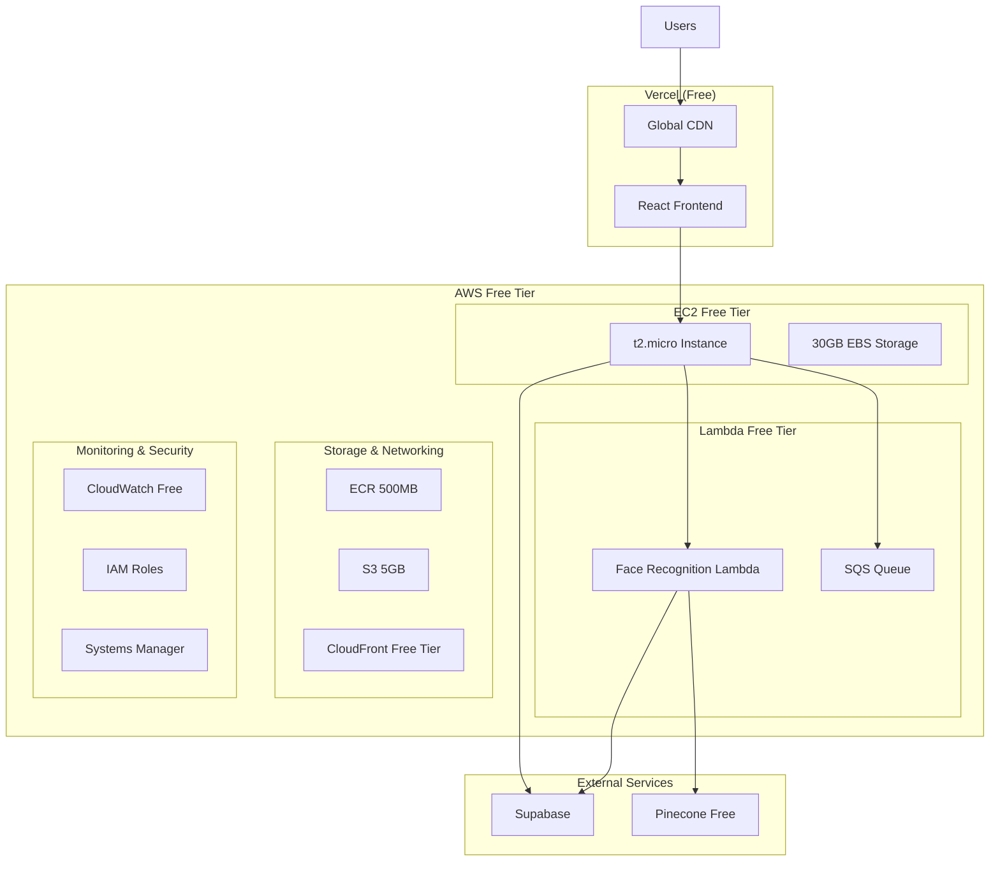

# AWS Free Tier Deployment Design

## Overview

This design outlines a complete deployment architecture using AWS Free Tier resources combined with Vercel free hosting, targeting $0-10/month costs in the first year. The architecture maximizes free tier benefits while maintaining production-ready functionality.

## Architecture

### AWS Free Tier Architecture



## Free Tier Limits and Usage

### AWS Free Tier Allocations (12 months)
- **EC2**: 750 hours/month t2.micro (1 vCPU, 1GB RAM)
- **EBS**: 30GB General Purpose SSD storage
- **Lambda**: 1M requests/month + 400,000 GB-seconds compute
- **S3**: 5GB storage + 20,000 GET + 2,000 PUT requests
- **CloudFront**: 50GB data transfer + 2M HTTP requests
- **ECR**: 500MB storage for container images
- **Data Transfer**: 15GB/month outbound

### Vercel Free Tier
- **Bandwidth**: 100GB/month
- **Build Minutes**: 6,000/month
- **Deployments**: Unlimited
- **Preview Deployments**: Unlimited

## Component Implementation

### Frontend Optimization (Vercel)

**Optimized Build Configuration:**
```typescript
// vite.config.ts
import { defineConfig } from 'vite'
import react from '@vitejs/plugin-react'
import { resolve } from 'path'

export default defineConfig({
  plugins: [react()],
  build: {
    rollupOptions: {
      output: {
        manualChunks: {
          vendor: ['react', 'react-dom'],
          router: ['react-router-dom'],
          supabase: ['@supabase/supabase-js'],
          ui: ['@heroicons/react']
        }
      }
    },
    minify: 'terser',
    terserOptions: {
      compress: {
        drop_console: true,
        drop_debugger: true,
        pure_funcs: ['console.log']
      }
    },
    chunkSizeWarningLimit: 1000
  },
  resolve: {
    alias: {
      '@': resolve(__dirname, 'src')
    }
  }
})
```

**Environment Configuration:**
```typescript
// src/config/environment.ts
interface Config {
  apiUrl: string;
  supabaseUrl: string;
  supabaseKey: string;
  environment: 'development' | 'staging' | 'production';
}

export const config: Config = {
  apiUrl: import.meta.env.VITE_API_URL || 'http://localhost:8000',
  supabaseUrl: import.meta.env.VITE_SUPABASE_URL!,
  supabaseKey: import.meta.env.VITE_SUPABASE_ANON_KEY!,
  environment: (import.meta.env.VITE_ENVIRONMENT as Config['environment']) || 'development'
};
```

### Backend Optimization (t2.micro)

**Memory-Optimized FastAPI:**
```python
# main.py
from fastapi import FastAPI, HTTPException
from fastapi.middleware.cors import CORSMiddleware
from contextlib import asynccontextmanager
import uvicorn
import os
import gc

# Memory optimization
import sys
sys.dont_write_bytecode = True

@asynccontextmanager
async def lifespan(app: FastAPI):
    # Startup
    print("Starting Acadion Backend...")
    yield
    # Shutdown
    gc.collect()

app = FastAPI(
    title="Acadion API",
    description="Student Management Platform API",
    version="1.0.0",
    lifespan=lifespan,
    docs_url="/docs" if os.getenv("ENVIRONMENT") != "production" else None
)

# CORS configuration for Vercel
app.add_middleware(
    CORSMiddleware,
    allow_origins=[
        "https://*.vercel.app",
        "https://acadion.vercel.app",  # Your production domain
        "http://localhost:5173",      # Local development
    ],
    allow_credentials=True,
    allow_methods=["*"],
    allow_headers=["*"],
)

# Health check endpoint
@app.get("/health")
async def health_check():
    return {"status": "healthy", "service": "acadion-backend"}

if __name__ == "__main__":
    uvicorn.run(
        "main:app",
        host="0.0.0.0",
        port=8000,
        workers=1,  # Single worker for t2.micro
        access_log=False,  # Reduce memory usage
        reload=False
    )
```

**Optimized Dockerfile:**
```dockerfile
# Multi-stage build for smaller image
FROM python:3.11-slim as builder

WORKDIR /app
COPY requirements.txt .
RUN pip install --no-cache-dir --user -r requirements.txt

FROM python:3.11-slim

# Copy only necessary files
COPY --from=builder /root/.local /root/.local
WORKDIR /app
COPY . .

# Make sure scripts in .local are usable
ENV PATH=/root/.local/bin:$PATH

# Optimize for t2.micro (1GB RAM)
ENV PYTHONUNBUFFERED=1
ENV PYTHONDONTWRITEBYTECODE=1
ENV PYTHONOPTIMIZE=1

EXPOSE 8000

# Use single worker to minimize memory usage
CMD ["uvicorn", "main:app", "--host", "0.0.0.0", "--port", "8000", "--workers", "1"]
```

### Lambda Face Recognition Service

**Optimized Lambda Function:**
```python
# lambda_function.py
import json
import base64
import cv2
import numpy as np
import face_recognition
import boto3
from typing import List, Dict, Optional
import os

# Initialize clients outside handler for reuse
s3_client = boto3.client('s3')
sqs_client = boto3.client('sqs')

def lambda_handler(event, context):
    """
    Process face recognition requests with memory optimization
    """
    try:
        # Parse input
        if 'Records' in event:
            # SQS trigger
            for record in event['Records']:
                body = json.loads(record['body'])
                return process_face_request(body)
        else:
            # Direct invocation
            return process_face_request(event)
            
    except Exception as e:
        print(f"Error processing request: {str(e)}")
        return {
            'statusCode': 500,
            'body': json.dumps({'error': str(e)})
        }

def process_face_request(request_data: Dict) -> Dict:
    """Process single face recognition request"""
    
    # Decode image
    image_data = base64.b64decode(request_data['image'])
    nparr = np.frombuffer(image_data, np.uint8)
    image = cv2.imdecode(nparr, cv2.IMREAD_COLOR)
    
    # Optimize image size to reduce processing time
    height, width = image.shape[:2]
    if width > 800:
        scale = 800 / width
        new_width = int(width * scale)
        new_height = int(height * scale)
        image = cv2.resize(image, (new_width, new_height))
    
    # Use HOG model for faster processing (CPU optimized)
    face_locations = face_recognition.face_locations(image, model="hog")
    face_encodings = face_recognition.face_encodings(image, face_locations)
    
    # Convert to serializable format
    results = []
    for i, encoding in enumerate(face_encodings):
        results.append({
            'face_id': i,
            'location': face_locations[i],
            'encoding': encoding.tolist()
        })
    
    return {
        'statusCode': 200,
        'body': json.dumps({
            'faces_detected': len(results),
            'faces': results,
            'processing_time': context.get_remaining_time_in_millis() if context else 0
        })
    }
```

**Lambda Deployment Package:**
```yaml
# serverless.yml (if using Serverless Framework)
service: acadion-face-recognition

provider:
  name: aws
  runtime: python3.9
  region: us-east-1
  memorySize: 1024  # Optimal for face processing
  timeout: 30
  
functions:
  processFaces:
    handler: lambda_function.lambda_handler
    events:
      - sqs:
          arn: !GetAtt FaceProcessingQueue.Arn
          batchSize: 1
    environment:
      PINECONE_API_KEY: ${env:PINECONE_API_KEY}
      SUPABASE_URL: ${env:SUPABASE_URL}

resources:
  Resources:
    FaceProcessingQueue:
      Type: AWS::SQS::Queue
      Properties:
        QueueName: acadion-face-processing
        VisibilityTimeoutSeconds: 60
```

## CI/CD Pipeline Implementation

### GitHub Actions Workflow

**Complete CI/CD Pipeline:**
```yaml
name: AWS Free Tier CI/CD
on:
  push:
    branches: [main, develop]
  pull_request:
    branches: [main]

env:
  AWS_REGION: us-east-1
  ECR_REPOSITORY: acadion-backend

jobs:
  # Frontend deployment to Vercel
  frontend:
    runs-on: ubuntu-latest
    if: contains(github.event.head_commit.modified, 'frontend/') || github.event_name == 'pull_request'
    
    steps:
      - name: Checkout code
        uses: actions/checkout@v3
      
      - name: Setup Node.js
        uses: actions/setup-node@v3
        with:
          node-version: '18'
          cache: 'npm'
          cache-dependency-path: frontend/package-lock.json
      
      - name: Install dependencies
        run: cd frontend && npm ci
      
      - name: Run tests
        run: cd frontend && npm run test:ci
      
      - name: Build application
        run: cd frontend && npm run build
        env:
          VITE_API_URL: ${{ secrets.API_URL }}
          VITE_SUPABASE_URL: ${{ secrets.SUPABASE_URL }}
          VITE_SUPABASE_ANON_KEY: ${{ secrets.SUPABASE_ANON_KEY }}
      
      - name: Deploy to Vercel
        if: github.ref == 'refs/heads/main'
        uses: amondnet/vercel-action@v25
        with:
          vercel-token: ${{ secrets.VERCEL_TOKEN }}
          vercel-org-id: ${{ secrets.VERCEL_ORG_ID }}
          vercel-project-id: ${{ secrets.VERCEL_PROJECT_ID }}
          working-directory: frontend

  # Backend deployment to EC2
  backend:
    runs-on: ubuntu-latest
    if: contains(github.event.head_commit.modified, 'backend/') || github.event_name == 'pull_request'
    
    steps:
      - name: Checkout code
        uses: actions/checkout@v3
      
      - name: Configure AWS credentials
        uses: aws-actions/configure-aws-credentials@v2
        with:
          aws-access-key-id: ${{ secrets.AWS_ACCESS_KEY_ID }}
          aws-secret-access-key: ${{ secrets.AWS_SECRET_ACCESS_KEY }}
          aws-region: ${{ env.AWS_REGION }}
      
      - name: Login to Amazon ECR
        id: login-ecr
        uses: aws-actions/amazon-ecr-login@v1
      
      - name: Build and push Docker image
        env:
          ECR_REGISTRY: ${{ steps.login-ecr.outputs.registry }}
          IMAGE_TAG: ${{ github.sha }}
        run: |
          docker build -t $ECR_REGISTRY/$ECR_REPOSITORY:$IMAGE_TAG backend/
          docker push $ECR_REGISTRY/$ECR_REPOSITORY:$IMAGE_TAG
          echo "image=$ECR_REGISTRY/$ECR_REPOSITORY:$IMAGE_TAG" >> $GITHUB_OUTPUT
      
      - name: Deploy to EC2
        if: github.ref == 'refs/heads/main'
        run: |
          # Create deployment package
          mkdir -p deployment
          echo "${{ steps.build-image.outputs.image }}" > deployment/image_uri.txt
          
          # Create CodeDeploy deployment
          aws deploy create-deployment \
            --application-name acadion-backend \
            --deployment-group-name production \
            --deployment-config-name CodeDeployDefault.EC2OneAtATime \
            --description "Deploy commit ${{ github.sha }}" \
            --s3-location bucket=${{ secrets.S3_DEPLOYMENT_BUCKET }},key=backend-${{ github.sha }}.zip,bundleType=zip

  # Lambda face recognition deployment
  lambda:
    runs-on: ubuntu-latest
    if: contains(github.event.head_commit.modified, 'face-recognition-service/') || github.event_name == 'pull_request'
    
    steps:
      - name: Checkout code
        uses: actions/checkout@v3
      
      - name: Setup Python
        uses: actions/setup-python@v4
        with:
          python-version: '3.9'
      
      - name: Install dependencies
        run: |
          cd face-recognition-service
          pip install -r requirements.txt -t .
      
      - name: Create deployment package
        run: |
          cd face-recognition-service
          zip -r ../lambda-deployment.zip .
      
      - name: Configure AWS credentials
        uses: aws-actions/configure-aws-credentials@v2
        with:
          aws-access-key-id: ${{ secrets.AWS_ACCESS_KEY_ID }}
          aws-secret-access-key: ${{ secrets.AWS_SECRET_ACCESS_KEY }}
          aws-region: ${{ env.AWS_REGION }}
      
      - name: Deploy Lambda function
        if: github.ref == 'refs/heads/main'
        run: |
          aws lambda update-function-code \
            --function-name acadion-face-recognition \
            --zip-file fileb://lambda-deployment.zip
```

This design provides a complete AWS Free Tier deployment with optimized resource usage and comprehensive CI/CD automation.