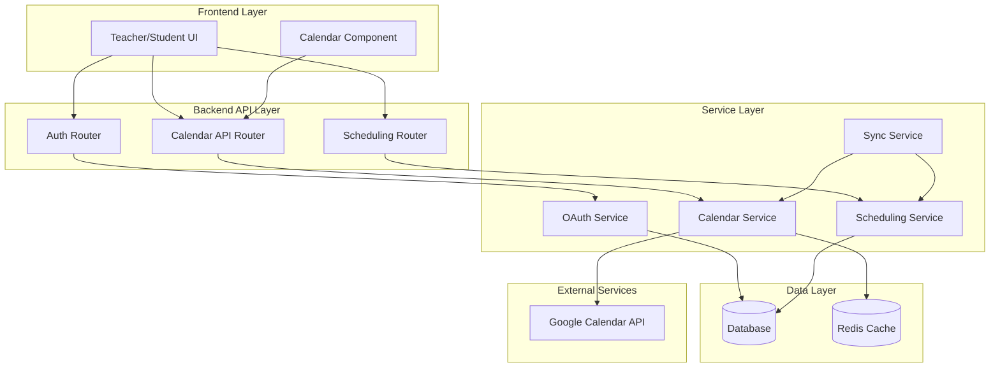

# Design Document

## Overview

The Google Calendar Class Scheduling feature integrates with Google Calendar API to provide seamless class scheduling capabilities for teachers and calendar visibility for students. The system leverages OAuth 2.0 for secure authentication and implements a robust event management system that synchronizes class schedules between the application and Google Calendar.

The design follows the existing FastAPI architecture with dedicated services for calendar operations, secure token management, and event synchronization. The system supports flexible recurrence patterns, conflict detection, and graceful degradation when external services are unavailable.

## Architecture

### High-Level Architecture



### Component Integration

The calendar scheduling system integrates with the existing application architecture:

- **Authentication**: Extends existing JWT-based auth with Google OAuth tokens
- **Database**: Adds calendar-related tables to existing schema
- **API**: New routers following existing FastAPI patterns
- **Services**: New service layer components following existing patterns

## Components and Interfaces

### 1. OAuth Service (`app/services/oauth_service.py`)

Handles Google OAuth 2.0 authentication flow and token management.

```python
class OAuthService:
    async def initiate_google_auth(self, user_id: int, redirect_uri: str) -> str
    async def handle_oauth_callback(self, code: str, state: str) -> dict
    async def refresh_access_token(self, user_id: int) -> str
    async def revoke_access(self, user_id: int) -> bool
    async def get_valid_token(self, user_id: int) -> Optional[str]
```

### 2. Calendar Service (`app/services/calendar_service.py`)

Manages Google Calendar API interactions and event operations.

```python
class CalendarService:
    async def create_event(self, user_id: int, event_data: CalendarEvent) -> str
    async def create_recurring_event(self, user_id: int, event_data: RecurringEvent) -> List[str]
    async def update_event(self, user_id: int, event_id: str, updates: dict) -> bool
    async def delete_event(self, user_id: int, event_id: str) -> bool
    async def get_events(self, user_id: int, start_date: datetime, end_date: datetime) -> List[dict]
    async def check_conflicts(self, user_id: int, event_time: datetime, duration: int) -> List[dict]
```

### 3. Scheduling Service (`app/services/scheduling_service.py`)

Manages class scheduling logic and database operations.

```python
class SchedulingService:
    async def create_class_schedule(self, teacher_id: int, schedule_data: ClassSchedule) -> int
    async def update_class_schedule(self, schedule_id: int, updates: dict, scope: str) -> bool
    async def delete_class_schedule(self, schedule_id: int, scope: str) -> bool
    async def get_teacher_schedules(self, teacher_id: int) -> List[ClassSchedule]
    async def get_student_schedules(self, student_id: int) -> List[ClassSchedule]
    async def sync_with_calendar(self, schedule_id: int) -> bool
```

### 4. Sync Service (`app/services/sync_service.py`)

Handles synchronization between internal schedules and Google Calendar.

```python
class SyncService:
    async def sync_schedule_to_calendar(self, schedule_id: int) -> bool
    async def sync_calendar_to_schedule(self, user_id: int) -> bool
    async def handle_calendar_webhook(self, webhook_data: dict) -> bool
    async def batch_sync_schedules(self, user_id: int) -> dict
```

### 5. API Routers

#### Calendar Router (`app/routers/calendar.py`)
- `POST /api/calendar/connect` - Initiate Google Calendar connection
- `GET /api/calendar/callback` - Handle OAuth callback
- `DELETE /api/calendar/disconnect` - Disconnect Google Calendar
- `GET /api/calendar/status` - Check connection status

#### Scheduling Router (`app/routers/scheduling.py`)
- `POST /api/schedules` - Create class schedule
- `GET /api/schedules` - Get schedules (teacher/student view)
- `PUT /api/schedules/{schedule_id}` - Update schedule
- `DELETE /api/schedules/{schedule_id}` - Delete schedule
- `POST /api/schedules/{schedule_id}/sync` - Manual sync with calendar

## Data Models

### Database Schema Extensions

```sql
-- Calendar connections table
CREATE TABLE calendar_connections (
    id SERIAL PRIMARY KEY,
    user_id INTEGER REFERENCES users(id) ON DELETE CASCADE,
    provider VARCHAR(50) NOT NULL DEFAULT 'google',
    access_token_encrypted TEXT NOT NULL,
    refresh_token_encrypted TEXT NOT NULL,
    token_expires_at TIMESTAMP WITH TIME ZONE,
    calendar_id VARCHAR(255),
    created_at TIMESTAMP WITH TIME ZONE DEFAULT NOW(),
    updated_at TIMESTAMP WITH TIME ZONE DEFAULT NOW(),
    UNIQUE(user_id, provider)
);

-- Class schedules table
CREATE TABLE class_schedules (
    id SERIAL PRIMARY KEY,
    teacher_id INTEGER REFERENCES users(id) ON DELETE CASCADE,
    subject_id INTEGER REFERENCES subjects(id) ON DELETE CASCADE,
    title VARCHAR(255) NOT NULL,
    description TEXT,
    start_datetime TIMESTAMP WITH TIME ZONE NOT NULL,
    duration_minutes INTEGER NOT NULL DEFAULT 60,
    recurrence_pattern JSONB, -- {type: 'weekly', interval: 1, days: [1,3,5], end_date: '2024-12-31'}
    google_event_id VARCHAR(255),
    google_recurring_event_id VARCHAR(255),
    is_active BOOLEAN DEFAULT TRUE,
    created_at TIMESTAMP WITH TIME ZONE DEFAULT NOW(),
    updated_at TIMESTAMP WITH TIME ZONE DEFAULT NOW()
);

-- Schedule instances for tracking individual occurrences
CREATE TABLE schedule_instances (
    id SERIAL PRIMARY KEY,
    schedule_id INTEGER REFERENCES class_schedules(id) ON DELETE CASCADE,
    instance_datetime TIMESTAMP WITH TIME ZONE NOT NULL,
    google_event_id VARCHAR(255),
    status VARCHAR(50) DEFAULT 'scheduled', -- scheduled, cancelled, completed
    created_at TIMESTAMP WITH TIME ZONE DEFAULT NOW(),
    updated_at TIMESTAMP WITH TIME ZONE DEFAULT NOW()
);

-- Student schedule visibility
CREATE TABLE student_schedule_access (
    id SERIAL PRIMARY KEY,
    student_id INTEGER REFERENCES users(id) ON DELETE CASCADE,
    schedule_id INTEGER REFERENCES class_schedules(id) ON DELETE CASCADE,
    sync_to_personal_calendar BOOLEAN DEFAULT FALSE,
    created_at TIMESTAMP WITH TIME ZONE DEFAULT NOW(),
    UNIQUE(student_id, schedule_id)
);
```

### Pydantic Models

```python
class CalendarConnection(BaseModel):
    id: int
    user_id: int
    provider: str
    calendar_id: Optional[str]
    is_connected: bool
    created_at: datetime

class ClassScheduleCreate(BaseModel):
    subject_id: int
    title: str
    description: Optional[str]
    start_datetime: datetime
    duration_minutes: int = 60
    recurrence_pattern: Optional[RecurrencePattern]

class RecurrencePattern(BaseModel):
    type: str  # 'weekly', 'biweekly', 'custom'
    interval: int = 1
    days_of_week: List[int] = []  # 0=Monday, 6=Sunday
    end_date: Optional[date]
    occurrence_count: Optional[int]

class ClassSchedule(BaseModel):
    id: int
    teacher_id: int
    subject_id: int
    title: str
    description: Optional[str]
    start_datetime: datetime
    duration_minutes: int
    recurrence_pattern: Optional[RecurrencePattern]
    google_event_id: Optional[str]
    is_active: bool
    instances: List[ScheduleInstance] = []
```

## Error Handling

### Error Categories and Responses

1. **Authentication Errors**
   - OAuth flow failures
   - Token expiration/refresh failures
   - Invalid or revoked permissions

2. **API Rate Limiting**
   - Google Calendar API quota exceeded
   - Exponential backoff implementation
   - Queue system for batch operations

3. **Calendar Conflicts**
   - Overlapping events detection
   - Conflict resolution suggestions
   - User notification system

4. **Sync Failures**
   - Network connectivity issues
   - Data consistency problems
   - Rollback mechanisms

### Error Handling Strategy

```python
class CalendarError(Exception):
    def __init__(self, message: str, error_code: str, retry_after: Optional[int] = None):
        self.message = message
        self.error_code = error_code
        self.retry_after = retry_after

class ErrorHandler:
    async def handle_api_error(self, error: Exception) -> dict
    async def handle_auth_error(self, error: Exception) -> dict
    async def handle_sync_error(self, error: Exception) -> dict
    async def schedule_retry(self, operation: str, params: dict, delay: int) -> None
```

## Testing Strategy

### Unit Testing

1. **Service Layer Tests**
   - OAuth flow simulation
   - Calendar API mocking
   - Database operation validation
   - Error scenario testing

2. **API Endpoint Tests**
   - Authentication validation
   - Request/response validation
   - Error handling verification

### Integration Testing

1. **Google Calendar API Integration**
   - OAuth flow end-to-end testing
   - Event CRUD operations
   - Webhook handling
   - Rate limiting behavior

2. **Database Integration**
   - Transaction handling
   - Data consistency validation
   - Migration testing

### End-to-End Testing

1. **User Workflow Testing**
   - Teacher calendar connection
   - Class scheduling and modification
   - Student calendar visibility
   - Sync reliability

2. **Performance Testing**
   - Bulk schedule creation
   - Concurrent user operations
   - API response times
   - Database query optimization

### Test Environment Setup

```python
# Test configuration
GOOGLE_CALENDAR_TEST_CONFIG = {
    "client_id": "test_client_id",
    "client_secret": "test_client_secret",
    "redirect_uri": "http://localhost:8000/api/calendar/callback",
    "scopes": ["https://www.googleapis.com/auth/calendar"]
}

# Mock Google Calendar API responses
class MockGoogleCalendarAPI:
    async def create_event(self, calendar_id: str, event: dict) -> dict
    async def update_event(self, calendar_id: str, event_id: str, event: dict) -> dict
    async def delete_event(self, calendar_id: str, event_id: str) -> bool
    async def list_events(self, calendar_id: str, **params) -> dict
```

## Security Considerations

### Token Security
- Encrypt all OAuth tokens using AES-256
- Store refresh tokens separately from access tokens
- Implement token rotation policies
- Use secure key management (environment variables/secrets manager)

### API Security
- Validate all calendar event data
- Sanitize user inputs to prevent injection
- Implement rate limiting per user
- Use HTTPS for all external API calls

### Data Privacy
- Minimal data collection from Google Calendar
- User consent for calendar access
- Data retention policies
- GDPR compliance for EU users

### Access Control
- Role-based permissions (teacher vs student)
- Schedule visibility controls
- Calendar sharing permissions
- Audit logging for sensitive operations