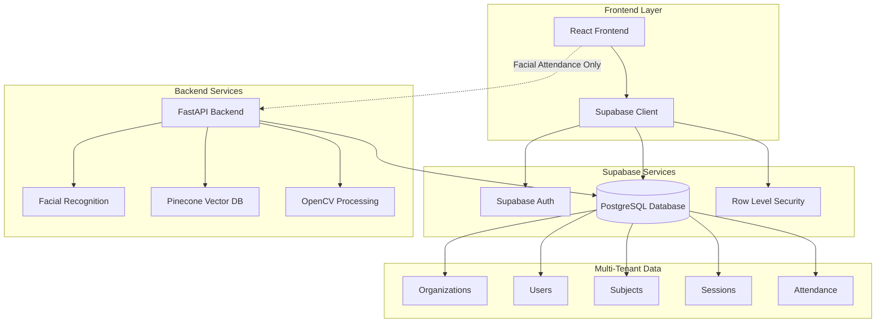
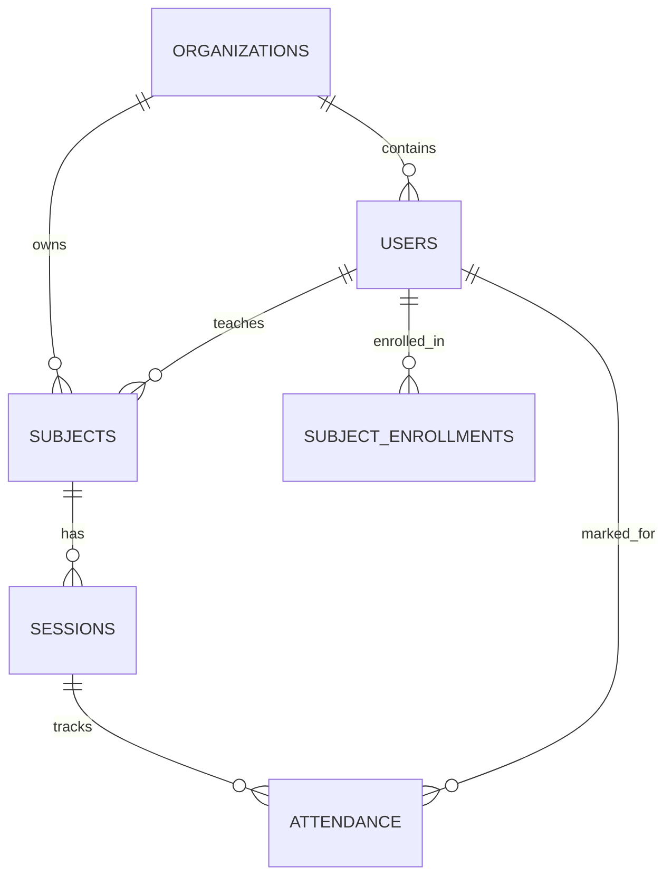
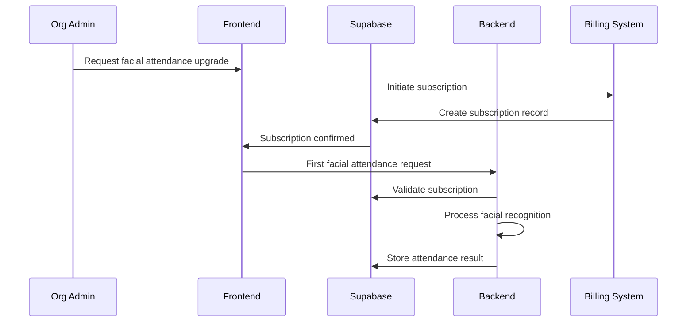

# Design Document

## Overview

The multi-tenant authentication system for Acadion will transform the current single-tenant architecture into a scalable, organization-based platform that supports multiple educational institutions. The system separates concerns by having the frontend handle all CRUD operations directly through Supabase while the backend specializes in AI-powered facial attendance services. Each organization operates as an isolated tenant with role-based access control and service tier management.

## Architecture

### High-Level Architecture



### Service Separation

- **Frontend**: Direct Supabase integration for all CRUD operations, real-time updates, authentication
- **Backend**: Specialized facial recognition services, AI processing, attendance automation
- **Database**: Multi-tenant data with organization-based isolation via RLS policies

## Components and Interfaces

### 1. Organization Management Component

**Purpose**: Handle organization creation and service tier management

**Key Functions**:
- Organization creation with default manual attendance
- Facial attendance module enable/disable functionality
- Module status validation and feature gating
- Organization context management

**Database Integration**:
```sql
-- Organizations table structure
CREATE TABLE public.organizations (
    organization_id uuid PRIMARY KEY DEFAULT gen_random_uuid(),
    name varchar NOT NULL UNIQUE,
    description text,
    is_active boolean DEFAULT true,
    created_at timestamptz DEFAULT now(),
    updated_at timestamptz DEFAULT now()
);

-- Organization subscriptions for paid modules
CREATE TABLE public.organization_subscriptions (
    subscription_id uuid PRIMARY KEY DEFAULT gen_random_uuid(),
    organization_id uuid NOT NULL REFERENCES organizations(organization_id),
    module_name varchar NOT NULL CHECK (module_name IN ('facial_attendance')),
    status varchar NOT NULL DEFAULT 'inactive' CHECK (status IN ('active', 'inactive', 'expired', 'cancelled')),
    start_date timestamptz NOT NULL,
    end_date timestamptz,
    billing_cycle varchar DEFAULT 'monthly' CHECK (billing_cycle IN ('monthly', 'yearly')),
    created_at timestamptz DEFAULT now(),
    updated_at timestamptz DEFAULT now(),
    UNIQUE(organization_id, module_name)
);
```

### 2. Multi-Tenant Authentication Component

**Purpose**: Manage user authentication within organization context

**Key Functions**:
- OAuth integration with Google
- Organization-scoped user sessions
- Role-based access control
- JWT token management with organization claims

**Authentication Flow**:
1. User initiates OAuth with Google
2. Supabase Auth handles OAuth callback
3. Frontend calls `ensure_user_profile()` RPC function
4. System establishes organization context
5. User gains access to tenant-specific resources

### 3. User Profile Management Component

**Purpose**: Handle user profiles and role management within organizations

**Database Integration**:
```sql
-- Users table with organization association
CREATE TABLE public.users (
    user_id uuid PRIMARY KEY DEFAULT gen_random_uuid(),
    auth_user_id uuid UNIQUE, -- References auth.users(id) without FK constraint
    organization_id uuid NOT NULL REFERENCES organizations(organization_id),
    email varchar NOT NULL UNIQUE,
    name varchar NOT NULL,
    active_role varchar DEFAULT 'student' CHECK (active_role IN ('teacher', 'student')),
    face_encoding_id varchar,
    is_face_registered boolean DEFAULT false,
    auth_provider varchar DEFAULT 'google' CHECK (auth_provider IN ('email', 'google')),
    google_id varchar UNIQUE,
    created_at timestamptz DEFAULT now(),
    updated_at timestamptz DEFAULT now()
);
```

### 4. Facial Attendance Backend Service

**Purpose**: Process facial recognition for attendance marking

**Key Functions**:
- Face detection and encoding using OpenCV
- Vector similarity matching with Pinecone
- Group photo processing for multiple attendees
- Facial attendance module validation before processing

**API Endpoints**:
- `POST /api/attendance/facial-recognition` - Process facial attendance
- `POST /api/attendance/register-face` - Register user face encoding
- `GET /api/attendance/facial-status` - Check facial registration status

### 5. Subscription Management Component

**Purpose**: Handle organization subscriptions and paid module access

**Key Functions**:
- Subscription creation and management
- Module access validation based on active subscriptions
- Billing cycle management and renewal tracking
- Feature gating based on subscription status

**API Endpoints**:
- `POST /api/subscriptions/activate` - Activate module subscription
- `GET /api/subscriptions/status` - Check subscription status
- `PUT /api/subscriptions/update` - Update subscription details
- `DELETE /api/subscriptions/cancel` - Cancel subscription

**Database Integration**:
```sql
-- Function to check if organization has active module subscription
CREATE OR REPLACE FUNCTION check_module_access(org_id uuid, module_name text)
RETURNS boolean AS $$
BEGIN
    RETURN EXISTS (
        SELECT 1 FROM organization_subscriptions 
        WHERE organization_id = org_id 
        AND module_name = module_name 
        AND status = 'active' 
        AND (end_date IS NULL OR end_date > NOW())
    );
END;
$$ LANGUAGE plpgsql;
```

### 6. Frontend Direct Database Integration

**Purpose**: Handle all CRUD operations through Supabase client

**Key Functions**:
- Real-time data synchronization
- Direct database queries with RLS filtering
- Organization-scoped data access
- Session management

## Data Models

### Core Entities

1. **Organizations**: Independent tenants with service tiers
2. **Users**: Organization-scoped user profiles with roles
3. **Subjects**: Classes/courses within organizations
4. **Sessions**: Individual class sessions for attendance
5. **Attendance**: Attendance records with method tracking

### Relationships



### Data Isolation Strategy

- **Organization ID**: Every tenant-specific table includes `organization_id`
- **Row Level Security**: Automatic filtering based on user's organization context
- **JWT Claims**: Organization context embedded in authentication tokens
- **API Filtering**: All queries automatically scoped to user's organization

## Error Handling

### Authentication Errors
- **Invalid Organization**: Redirect to organization selection
- **Insufficient Permissions**: Display role-based error messages
- **Session Expiry**: Automatic token refresh or re-authentication

### Facial Recognition Errors
- **Service Tier Restriction**: Clear upgrade prompts for unpaid organizations
- **Face Not Registered**: Guidance for face registration process
- **Recognition Failure**: Fallback to manual attendance with error logging
- **Multiple Faces Detected**: Confirmation dialog for group attendance

### Database Errors
- **Connection Issues**: Graceful degradation with offline capabilities
- **Constraint Violations**: User-friendly validation messages
- **RLS Policy Violations**: Security logging and access denial

## Dynamic Paid Module Implementation Strategy

### Architecture Overview for Paid Modules

The system implements a **subscription-based module architecture** where:

1. **Base System**: All organizations get manual attendance (free)
2. **Paid Modules**: Facial attendance requires active subscription
3. **Dynamic Validation**: Real-time checking of subscription status
4. **Graceful Degradation**: Automatic fallback when subscriptions expire

### Implementation Approach

#### 1. Database Layer (Multi-Tenant + Subscription)
```sql
-- Core organization with base features
CREATE TABLE organizations (
    organization_id uuid PRIMARY KEY,
    name varchar NOT NULL,
    -- Base organization data
);

-- Subscription tracking per organization per module
CREATE TABLE organization_subscriptions (
    organization_id uuid REFERENCES organizations(organization_id),
    module_name varchar, -- 'facial_attendance', future: 'analytics', 'reporting'
    status varchar, -- 'active', 'expired', 'cancelled'
    start_date timestamptz,
    end_date timestamptz,
    -- Billing info
);

-- Usage tracking for billing
CREATE TABLE module_usage (
    organization_id uuid,
    module_name varchar,
    usage_date date,
    usage_count integer,
    -- Track API calls, face recognitions, etc.
);
```

#### 2. Backend Service Layer (Module Validation)
```python
# Middleware for module access validation
class ModuleAccessMiddleware:
    async def validate_module_access(self, org_id: str, module: str):
        # Check active subscription
        subscription = await check_subscription(org_id, module)
        if not subscription or subscription.expired:
            raise ModuleAccessDenied(f"{module} requires active subscription")
        
        # Log usage for billing
        await log_module_usage(org_id, module)
        return True

# Facial attendance service with subscription check
class FacialAttendanceService:
    async def process_attendance(self, org_id: str, image_data):
        # Validate subscription before processing
        await self.validate_module_access(org_id, 'facial_attendance')
        
        # Process facial recognition
        return await self.recognize_faces(image_data)
```

#### 3. Frontend Layer (Dynamic UI)
```typescript
// Hook for checking module access
const useModuleAccess = (moduleName: string) => {
  const { organization } = useAuth();
  
  return useQuery(['module-access', organization.id, moduleName], 
    () => checkModuleSubscription(organization.id, moduleName)
  );
};

// Component with conditional rendering
const AttendanceOptions = () => {
  const { data: facialAccess } = useModuleAccess('facial_attendance');
  
  return (
    <div>
      {/* Manual attendance - always available */}
      <ManualAttendanceButton />
      
      {/* Facial attendance - subscription required */}
      {facialAccess?.active ? (
        <FacialAttendanceButton />
      ) : (
        <UpgradePrompt module="facial_attendance" />
      )}
    </div>
  );
};
```

#### 4. Subscription Management Flow


### Key Implementation Benefits

1. **Scalable**: Easy to add new paid modules (analytics, reporting, etc.)
2. **Flexible**: Different billing cycles, trial periods, feature tiers
3. **Secure**: Server-side validation prevents bypass
4. **User-Friendly**: Graceful degradation and clear upgrade paths
5. **Multi-Tenant**: Each organization manages their own subscriptions

### Subscription States and Behavior

| Subscription State | Facial Attendance Access | UI Behavior |
|-------------------|-------------------------|-------------|
| No Subscription | ❌ Blocked | Show upgrade prompt |
| Active | ✅ Full Access | Show all features |
| Expired | ❌ Blocked | Show renewal prompt |
| Grace Period | ⚠️ Limited Access | Show payment reminder |

## Testing Strategy

### Unit Testing
- **Authentication Functions**: OAuth flow, token validation, role switching
- **Facial Recognition**: Face encoding, similarity matching, group processing
- **Database Operations**: CRUD operations, RLS policy enforcement
- **Service Tier Logic**: Feature gating, upgrade flows

### Integration Testing
- **End-to-End Authentication**: Complete OAuth flow with organization context
- **Multi-Tenant Data Access**: Cross-organization isolation verification
- **Facial Attendance Flow**: Complete face registration to attendance marking
- **Real-time Updates**: Frontend synchronization with database changes

### Security Testing
- **Tenant Isolation**: Verify no cross-organization data access
- **Role-Based Access**: Confirm proper permission enforcement
- **OAuth Security**: Token validation and session management
- **Face Data Privacy**: Ensure no actual images stored, only mathematical vectors

### Performance Testing
- **Concurrent Users**: Multiple organizations with simultaneous access
- **Facial Recognition Speed**: Processing time for individual and group photos
- **Database Queries**: RLS policy impact on query performance
- **Real-time Synchronization**: Frontend update latency testing