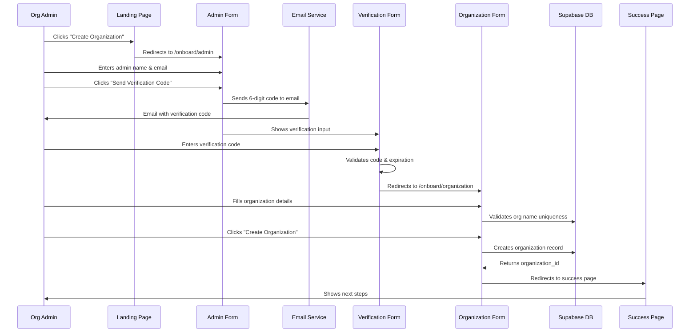
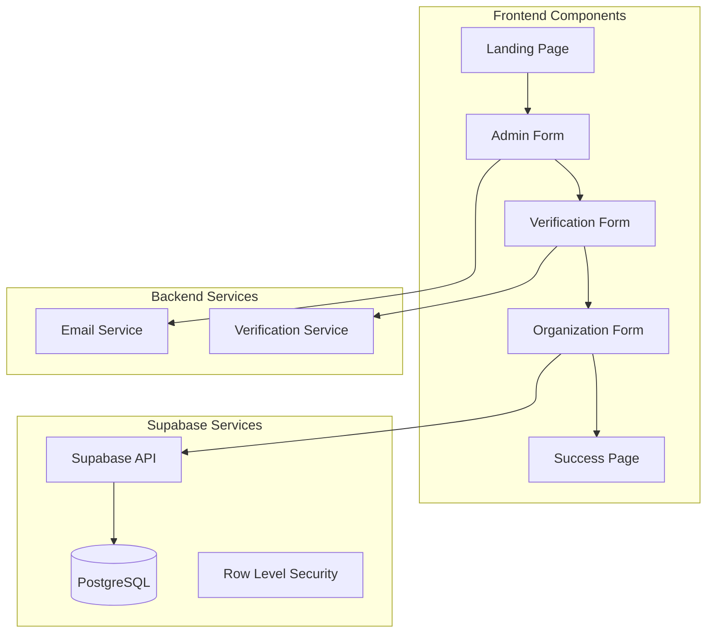

# Design Document

## Overview

The organization onboarding feature creates a streamlined registration flow for new educational institutions to join the Acadion SaaS platform. This feature provides a dedicated multi-step process accessible from the landing page where organization administrators first verify their identity via email, then register their institution and create the foundational setup for their tenant. The design focuses on security and simplicity - first verifying the administrator's email address, then capturing essential organization information and creating the database records.

## Architecture

### High-Level Flow



### Component Architecture



## Components and Interfaces

### 1. Landing Page Integration

**Purpose**: Provide entry point to organization onboarding

**Key Functions**:
- Display "Create Organization" or "Get Started" call-to-action button
- Route users to the onboarding page
- Maintain existing landing page design consistency

**Implementation**:
```typescript
// Add to existing landing page component
const LandingPage = () => {
  const navigate = useNavigate();
  
  return (
    <div>
      {/* Existing landing content */}
      <button 
        onClick={() => navigate('/onboard')}
        className="bg-blue-600 text-white px-6 py-3 rounded-lg"
      >
        Create Organization
      </button>
    </div>
  );
};
```

### 2. Admin Form Page

**Purpose**: Initial step to capture and verify administrator details

**Key Functions**:
- Display administrator information form
- Handle email verification code sending
- Manage loading states and error handling
- Navigate to verification step

**Route**: `/onboard/admin`

**Component Structure**:
```typescript
interface AdminFormProps {}

interface AdminFormData {
  adminName: string;
  adminEmail: string;
}

const AdminForm: React.FC = () => {
  const [formData, setFormData] = useState<AdminFormData>();
  const [isLoading, setIsLoading] = useState(false);
  const [errors, setErrors] = useState<Record<string, string>>();
  const [codeSent, setCodeSent] = useState(false);
  
  // Form validation, code sending logic
};
```

### 3. Email Verification Form

**Purpose**: Verify administrator email with 6-digit code

**Key Functions**:
- Display verification code input
- Validate verification codes
- Handle resend functionality
- Navigate to organization form upon success

**Route**: `/onboard/verify` (or embedded in admin form)

**Component Structure**:
```typescript
interface VerificationFormProps {
  email: string;
  onVerificationSuccess: () => void;
}

interface VerificationState {
  code: string;
  isVerifying: boolean;
  resendCount: number;
  timeUntilResend: number;
}

const VerificationForm: React.FC<VerificationFormProps> = ({ email, onVerificationSuccess }) => {
  const [state, setState] = useState<VerificationState>();
  
  // Code validation, resend logic
};
```

### 4. Organization Details Form

**Purpose**: Capture organization information after admin verification

**Key Functions**:
- Display organization registration form
- Handle form validation and submission
- Create organization record
- Redirect to success page upon completion

**Route**: `/onboard/organization`

**Component Structure**:
```typescript
interface OrganizationFormProps {
  verifiedAdmin: AdminFormData;
}

interface OrganizationFormData {
  organizationName: string;
  organizationDomain?: string;
  organizationDescription?: string;
}

const OrganizationForm: React.FC<OrganizationFormProps> = ({ verifiedAdmin }) => {
  const [formData, setFormData] = useState<OrganizationFormData>();
  const [isLoading, setIsLoading] = useState(false);
  const [errors, setErrors] = useState<Record<string, string>>();
  
  // Form validation, organization creation logic
};
```

### 5. Form Field Specifications

#### Admin Form Fields:
1. **Administrator Name** (required)
   - Text input for full name
   - Validation: 2-50 characters, non-empty
   
2. **Administrator Email** (required)
   - Email input with format validation
   - Will be used for verification and future OAuth setup

#### Verification Form Fields:
1. **Verification Code** (required)
   - 6-digit numeric input
   - Auto-focus and auto-advance between digits
   - Validation: exactly 6 digits, not expired
   
2. **Resend Controls**
   - Resend button (enabled after 60 seconds)
   - Countdown timer display
   - Maximum 3 resend attempts

#### Organization Form Fields:
1. **Organization Name** (required)
   - Text input with real-time validation
   - Uniqueness check against database
   - Validation: 2-100 characters, unique
   
2. **Organization Domain** (optional)
   - Text input with domain format validation
   - Placeholder: "example.edu"
   - Help text explaining future use
   
3. **Organization Description** (optional)
   - Textarea for additional details
   - Validation: max 500 characters

**Validation Rules**:
- Admin name: Required, 2-50 characters
- Admin email: Required, valid email format
- Verification code: Required, 6 digits, not expired
- Organization name: Required, 2-100 characters, unique
- Domain: Optional, valid domain format if provided
- Description: Optional, max 500 characters

### 4. Database Integration Layer

**Purpose**: Handle organization creation and data persistence

**Database Operations**:

#### Organization Creation
```sql
-- Insert new organization
INSERT INTO public.organizations (name, domain, description, is_active)
VALUES ($1, $2, $3, true)
RETURNING organization_id, name, created_at;
```

#### Uniqueness Validation
```sql
-- Check organization name uniqueness
SELECT EXISTS(
  SELECT 1 FROM public.organizations 
  WHERE LOWER(name) = LOWER($1) AND is_active = true
);

-- Check domain uniqueness (if provided)
SELECT EXISTS(
  SELECT 1 FROM public.organizations 
  WHERE LOWER(domain) = LOWER($1) AND is_active = true
);
```

### 5. Success Page Component

**Purpose**: Confirm successful organization creation and provide next steps

**Key Functions**:
- Display success confirmation
- Show organization details
- Provide guidance for next steps
- Offer links to documentation or support

**Content Elements**:
- Success message with organization name
- Next steps checklist
- Contact information for support
- Link to sign in when ready

## Data Models

### Updated Organization Schema

```sql
-- Add domain field to organizations table
ALTER TABLE public.organizations 
ADD COLUMN domain varchar(255);

-- Add unique constraint for domain (excluding nulls)
CREATE UNIQUE INDEX organizations_domain_unique 
ON public.organizations (domain) 
WHERE domain IS NOT NULL AND is_active = true;
```

### Updated User Role Schema

```sql
-- Update user role constraint to include admin
ALTER TABLE public.users 
DROP CONSTRAINT IF EXISTS users_active_role_check;

ALTER TABLE public.users 
ADD CONSTRAINT users_active_role_check 
CHECK (active_role IN ('admin', 'teacher', 'student'));
```

### Organization Data Model

```typescript
interface Organization {
  organization_id: string;
  name: string;
  domain?: string;
  description?: string;
  is_active: boolean;
  created_at: string;
  updated_at: string;
}
```

### Form Validation Schema

```typescript
const organizationSchema = z.object({
  organizationName: z.string()
    .min(2, "Organization name must be at least 2 characters")
    .max(100, "Organization name must be less than 100 characters"),
  organizationDomain: z.string()
    .regex(/^[a-zA-Z0-9][a-zA-Z0-9-]{1,61}[a-zA-Z0-9]\.[a-zA-Z]{2,}$/, "Invalid domain format")
    .optional(),
  adminName: z.string()
    .min(2, "Administrator name must be at least 2 characters")
    .max(50, "Administrator name must be less than 50 characters"),
  adminEmail: z.string()
    .email("Invalid email format")
});
```

## Error Handling

### Form Validation Errors

**Organization Name Conflicts**:
- Real-time validation during typing
- Clear error message: "This organization name is already taken"
- Suggestion to try variations

**Domain Conflicts**:
- Validation on blur or form submission
- Error message: "This domain is already registered with another organization"
- Option to proceed without domain

**Network Errors**:
- Retry mechanism for failed requests
- Clear error messages for connection issues
- Graceful degradation when validation services are unavailable

### Database Errors

**Constraint Violations**:
- Handle unique constraint errors gracefully
- Convert database errors to user-friendly messages
- Provide actionable guidance for resolution

**Connection Issues**:
- Display appropriate loading states
- Timeout handling for slow connections
- Retry options for failed submissions

### User Experience Errors

**Incomplete Forms**:
- Highlight required fields that are empty
- Prevent submission until all required fields are valid
- Clear indication of form completion status

**Browser Compatibility**:
- Fallback validation for older browsers
- Progressive enhancement for modern features
- Accessible error announcements for screen readers

## Testing Strategy

### Unit Testing

**Form Validation**:
- Test all validation rules for each field
- Verify error message display and clearing
- Test form submission prevention with invalid data

**Database Operations**:
- Test organization creation with valid data
- Test uniqueness validation for names and domains
- Test error handling for database constraints

**Component Rendering**:
- Test form rendering with different states
- Test success page display with organization data
- Test error state rendering and recovery

### Integration Testing

**End-to-End Flow**:
- Complete organization registration flow
- Navigation from landing page to success page
- Database record creation verification

**API Integration**:
- Test Supabase client integration
- Test real-time validation API calls
- Test error handling for API failures

**Cross-Browser Testing**:
- Test form functionality across browsers
- Test responsive design on different devices
- Test accessibility features with screen readers

### User Acceptance Testing

**Usability Testing**:
- Test form completion time and ease of use
- Test error message clarity and helpfulness
- Test success flow satisfaction and next steps clarity

**Business Logic Testing**:
- Verify organization creation meets business requirements
- Test admin role assignment and permissions
- Verify tenant isolation setup for new organizations

## Security Considerations

### Input Validation

**Client-Side Validation**:
- Sanitize all user inputs before processing
- Validate data types and formats
- Prevent XSS attacks through proper escaping

**Server-Side Validation**:
- Re-validate all inputs on the server
- Use parameterized queries to prevent SQL injection
- Implement rate limiting for form submissions

### Data Privacy

**Personal Information**:
- Minimize data collection to essential fields only
- Secure transmission of all form data
- Comply with data protection regulations

**Organization Data**:
- Ensure organization names and domains are not exposed inappropriately
- Implement proper access controls for organization data
- Audit trail for organization creation events

### Access Control

**Public Access**:
- Allow unauthenticated access to onboarding page
- Implement CAPTCHA or similar anti-bot measures
- Monitor for abuse and implement appropriate protections

**Database Security**:
- Use service role for organization creation
- Implement proper RLS policies for organization data
- Ensure admin users are properly scoped to their organizations