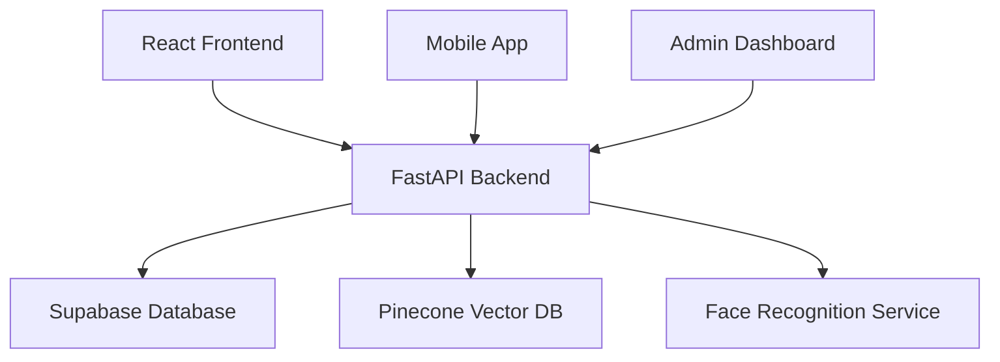

# 🎓 Acadion - AI-Powered Student Management Platform

[](https://opensource.org/licenses/MIT)
[](https://www.python.org/downloads/)
[](https://reactjs.org/)
[](https://fastapi.tiangolo.com/)
[](https://www.docker.com/)

A modern, comprehensive student management system with AI-powered facial recognition attendance tracking. Built with cutting-edge technologies for educational institutions of all sizes.

## ✨ Key Features

### 🔐 Secure Authentication
- **JWT-based Authentication** with role-based access control
- **Multi-role Support** (Teachers, Students, Administrators)
- **Secure Password Handling** with bcrypt encryption

### 🤖 AI-Powered Attendance
- **Facial Recognition** - Upload group photos for instant attendance
- **Multi-face Detection** - Process multiple students simultaneously
- **High Accuracy** - Advanced algorithms with confidence scoring
- **Duplicate Prevention** - Smart detection prevents double-counting

### 👨‍🏫 Teacher Dashboard
- **Class Management** - Create and manage classes with unique invite codes
- **Real-time Analytics** - Track attendance patterns and statistics
- **Flexible Attendance** - Both AI-powered and manual options
- **Student Insights** - Monitor individual student performance

### 👨‍🎓 Student Portal
- **Easy Enrollment** - Join classes using invite codes
- **Face Registration** - One-time setup for automatic attendance
- **Attendance History** - View personal attendance records
- **Profile Management** - Update information and preferences

## 🛠️ Technology Stack

### Backend
- **[FastAPI](https://fastapi.tiangolo.com/)** - High-performance Python web framework
- **[Supabase](https://supabase.com/)** - PostgreSQL database with real-time features
- **[Pinecone](https://www.pinecone.io/)** - Vector database for face embeddings
- **[OpenCV](https://opencv.org/)** - Computer vision for face processing
- **[Pydantic](https://pydantic.dev/)** - Data validation and serialization

### Frontend
- **[React 18](https://reactjs.org/)** - Modern UI framework with concurrent features
- **[TypeScript](https://www.typescriptlang.org/)** - Type-safe JavaScript
- **[Tailwind CSS](https://tailwindcss.com/)** - Utility-first CSS framework
- **[Vite](https://vitejs.dev/)** - Lightning-fast build tool
- **[React Query](https://tanstack.com/query)** - Powerful data synchronization

### Infrastructure & Deployment
- **[AWS EC2](https://aws.amazon.com/ec2/)** - Backend hosting with Docker containers
- **[Vercel](https://vercel.com/)** - Frontend hosting with edge network
- **[GitHub Actions](https://github.com/features/actions)** - CI/CD pipelines
- **[Docker](https://www.docker.com/)** - Containerization and deployment
- **[Nginx](https://nginx.org/)** - Reverse proxy with SSL termination

### Infrastructure
- **[Docker](https://www.docker.com/)** - Containerized deployment
- **[Nginx](https://nginx.org/)** - High-performance web server
- **[GitHub Actions](https://github.com/features/actions)** - CI/CD pipeline

## 🚀 Quick Start

### Prerequisites
- **Docker & Docker Compose** (recommended)
- **Node.js 16+** and **Python 3.8+** (for local development)

### 1. Clone & Setup
```bash
git clone https://github.com/yosaad1000/Acadion.git
cd Acadion
cp backend/.env.example backend/.env
```

### 2. Configure Environment
Edit `backend/.env` with your credentials:
```env
# Supabase Configuration
SUPABASE_URL=your_supabase_project_url
SUPABASE_KEY=your_supabase_anon_key
SUPABASE_SERVICE_KEY=your_supabase_service_role_key

# AI Features (Optional)
PINECONE_API_KEY=your_pinecone_api_key
PINECONE_ENVIRONMENT=us-east-1
PINECONE_INDEX_NAME=student-faces

# Security
SECRET_KEY=your-super-secret-jwt-key
FACE_THRESHOLD=0.6
```

### 3. Launch Application
```bash
# Start all services
docker-compose up -d

# Check status
docker-compose ps
```

### 4. Access Your Platform
- **🌐 Web App**: [http://localhost:3000](http://localhost:3000)
- **📡 API Docs**: [http://localhost:8000/docs](http://localhost:8000/docs)
- **🔍 Health Check**: [http://localhost:8000/api/health](http://localhost:8000/api/health)

## 🚀 Production Deployment

Acadion is production-ready with automated CI/CD pipelines for both frontend and backend components.

### Live Production URLs
- **🌐 Frontend**: [https://acadion-gamma.vercel.app](https://acadion-gamma.vercel.app)
- **📡 Backend API**: [https://54.167.95.26](https://54.167.95.26)
- **📚 API Documentation**: [https://54.167.95.26/docs](https://54.167.95.26/docs)

### Automated Deployments
- **Frontend**: Deployed to Vercel with automatic HTTPS and global CDN
- **Backend**: Deployed to AWS EC2 with Docker containers and Nginx SSL
- **CI/CD**: GitHub Actions workflows for testing, building, and deployment
- **Preview Deployments**: Automatic preview URLs for pull requests

### Manual Deployment Scripts
```bash
# Deploy backend to EC2
./deploy-backend.ps1

# Deploy frontend to Vercel  
./deploy-vercel.ps1

# Setup HTTPS on EC2
./ssl-setup.sh
```

### Environment Configuration
- **Production Environment Variables**: Managed via GitHub Secrets and Vercel
- **SSL Certificates**: Automatic HTTPS on both frontend and backend
- **Health Monitoring**: Automated health checks and deployment notifications

For detailed deployment instructions, see [CI/CD Guidelines](.kiro/steering/ci-cd-guidelines.md).

## 📖 Documentation

- **[📚 Complete Documentation](https://yosaad1000.github.io/Acadion/)** - GitHub Pages
- **[🚀 Getting Started Guide](docs/getting-started.md)** - Detailed setup instructions
- **[📡 API Reference](docs/api-documentation.md)** - Comprehensive API documentation
- **[🏗️ Architecture Guide](docs/architecture.md)** - System design and components
- **[🤖 AI Agents Guide](agents.md)** - For AI-assisted development
- **[⚙️ CI/CD Guidelines](.kiro/steering/ci-cd-guidelines.md)** - Deployment and DevOps guide

## 🎯 Use Cases

### Educational Institutions
- **Universities** - Manage large student populations efficiently
- **K-12 Schools** - Streamline daily attendance tracking
- **Training Centers** - Monitor student engagement and participation

### Corporate & Professional
- **Employee Training** - Track attendance for compliance requirements
- **Workshops & Seminars** - Automated attendance for events
- **Certification Programs** - Maintain accurate attendance records

## 📊 System Architecture



## 🔒 Security & Privacy

- **🔐 Data Encryption** - All sensitive data encrypted at rest and in transit
- **🛡️ GDPR Compliant** - Privacy-first design with comprehensive data protection
- **🎭 Secure Face Storage** - Face data stored as mathematical vectors, not images
- **👥 Access Controls** - Granular permissions and role-based access
- **🔑 JWT Security** - Secure token-based authentication with refresh tokens

## 📈 Performance Metrics

- **⚡ Fast Recognition** - Process group photos in under 3 seconds
- **📊 Scalable Architecture** - Handle thousands of concurrent users
- **🗄️ Efficient Database** - Optimized queries with sub-100ms response times
- **📱 Mobile Responsive** - Works seamlessly across all devices

## 🤝 Contributing

We welcome contributions! Please see our [Contributing Guide](docs/contributing.md) for details.

1. **Fork** the repository
2. **Create** a feature branch (`git checkout -b feature/amazing-feature`)
3. **Commit** your changes (`git commit -m 'Add amazing feature'`)
4. **Push** to the branch (`git push origin feature/amazing-feature`)
5. **Open** a Pull Request

## 📄 License

This project is licensed under the MIT License - see the [LICENSE](LICENSE) file for details.

## 🙏 Acknowledgments

- **[Face Recognition Library](https://github.com/ageitgey/face_recognition)** by Adam Geitgey
- **[FastAPI](https://fastapi.tiangolo.com/)** by Sebastián Ramirez
- **[React](https://reactjs.org/)** by Meta
- **[Supabase](https://supabase.com/)** - Open source Firebase alternative
- **[Pinecone](https://www.pinecone.io/)** - Vector database platform

## 📞 Support

- **🐛 Bug Reports**: [GitHub Issues](https://github.com/yosaad1000/Acadion/issues)
- **💬 Discussions**: [GitHub Discussions](https://github.com/yosaad1000/Acadion/discussions)
- **📧 Email**: support@acadion.com
- **📖 Documentation**: [Acadion.github.io](https://yosaad1000.github.io/Acadion/)

---

<div align="center">

**Built with ❤️ for modern education**

[⭐ Star this repo](https://github.com/yosaad1000/Acadion) • [🐛 Report Bug](https://github.com/yosaad1000/Acadion/issues) • [✨ Request Feature](https://github.com/yosaad1000/Acadion/issues)

</div>