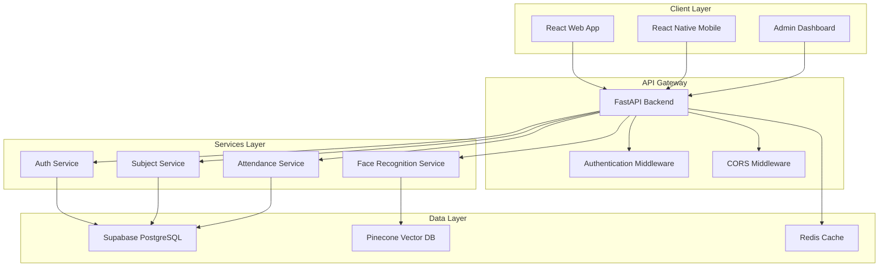
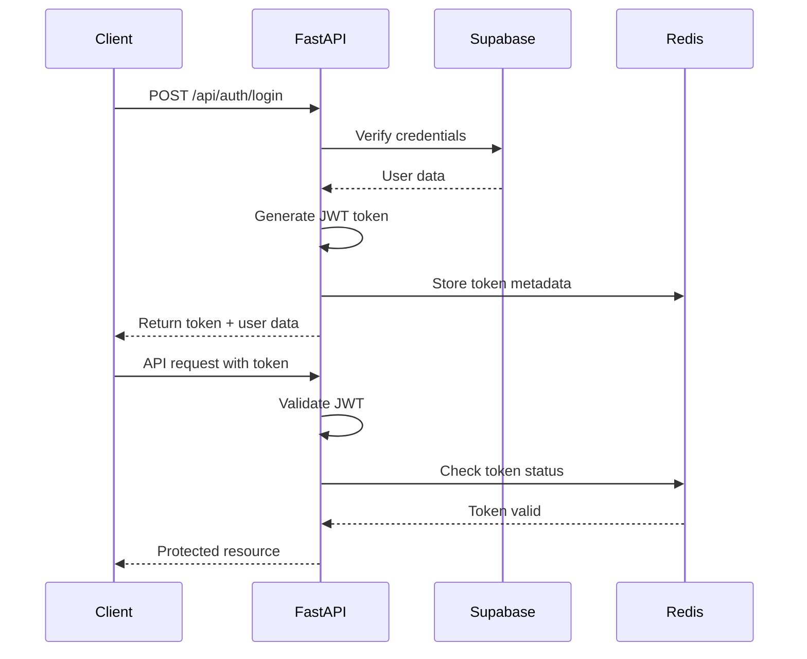
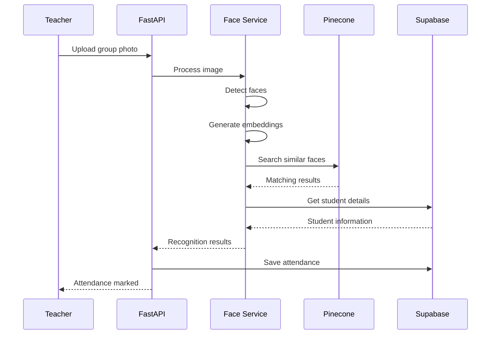
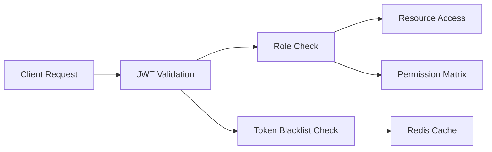
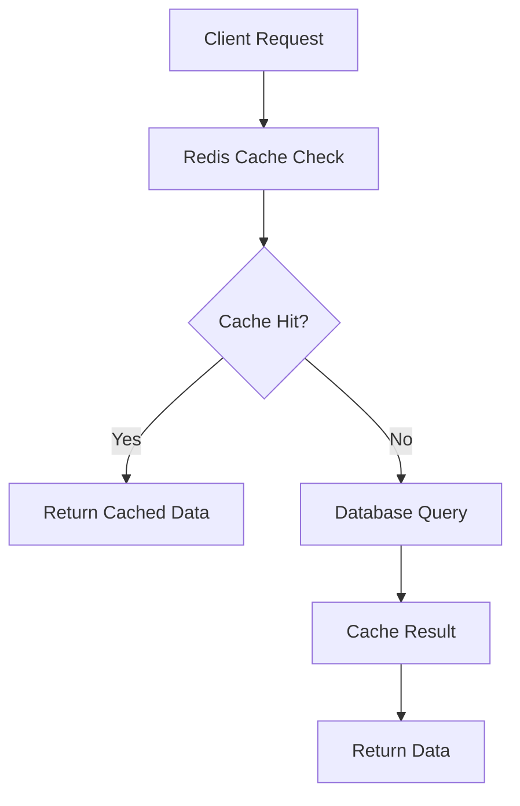

# 🏗️ System Architecture

Acadion is built with a modern, scalable architecture that separates concerns and enables independent scaling of different components.

## Overview



## Core Components

### Frontend Layer

#### React Web Application
- **Framework**: React 18 with TypeScript
- **Styling**: Tailwind CSS for responsive design
- **State Management**: React Query for server state
- **Routing**: React Router for client-side navigation
- **Build Tool**: Vite for fast development and building

#### Mobile Application
- **Framework**: React Native with Expo
- **Navigation**: React Navigation
- **Camera**: Expo Camera for photo capture
- **Storage**: AsyncStorage for local data

### Backend Layer

#### FastAPI Application
- **Framework**: FastAPI for high-performance API
- **Documentation**: Auto-generated OpenAPI/Swagger docs
- **Validation**: Pydantic models for request/response validation
- **Middleware**: CORS, authentication, and logging middleware

#### Authentication System
- **JWT Tokens**: Secure token-based authentication
- **Role-based Access**: Teacher, Student, and Admin roles
- **Password Security**: bcrypt hashing
- **Session Management**: Redis for token blacklisting

### Data Layer

#### Primary Database (Supabase)
- **Type**: PostgreSQL with real-time features
- **Authentication**: Built-in user management
- **Real-time**: WebSocket connections for live updates
- **Storage**: File storage for profile images

#### Vector Database (Pinecone)
- **Purpose**: Store face embeddings for recognition
- **Dimensions**: 128-dimensional face vectors
- **Indexing**: Optimized for similarity search
- **Scaling**: Handles millions of face vectors

#### Caching Layer (Redis)
- **Session Storage**: JWT token management
- **Rate Limiting**: API request throttling
- **Temporary Data**: Face processing results

## Data Flow

### User Authentication Flow



### Face Recognition Flow



## Security Architecture

### Authentication & Authorization



#### Security Layers
1. **Transport Security**: HTTPS/TLS encryption
2. **Authentication**: JWT token validation
3. **Authorization**: Role-based access control
4. **Input Validation**: Pydantic model validation
5. **Rate Limiting**: Redis-based request throttling
6. **CORS Protection**: Configurable origin restrictions

### Data Protection

#### Face Data Security
- **No Image Storage**: Only mathematical embeddings stored
- **Vector Encryption**: Embeddings encrypted in Pinecone
- **Access Control**: Strict API access to face data
- **Audit Logging**: All face operations logged

#### Personal Data Protection
- **Encryption at Rest**: Database encryption
- **Encryption in Transit**: TLS for all communications
- **Data Minimization**: Only necessary data collected
- **Right to Deletion**: GDPR-compliant data removal

## Scalability Design

### Horizontal Scaling

#### Application Layer
- **Stateless Design**: No server-side session storage
- **Load Balancing**: Multiple FastAPI instances
- **Container Orchestration**: Docker Swarm or Kubernetes
- **Auto-scaling**: Based on CPU/memory metrics

#### Database Layer
- **Read Replicas**: Supabase read scaling
- **Connection Pooling**: Efficient database connections
- **Query Optimization**: Indexed queries and caching
- **Sharding Strategy**: Future horizontal partitioning

### Performance Optimization

#### Caching Strategy


#### Face Recognition Optimization
- **Batch Processing**: Multiple faces in single request
- **Async Processing**: Non-blocking face recognition
- **Result Caching**: Cache recognition results
- **Model Optimization**: Efficient face detection models

## Deployment Architecture

### Development Environment
```
Developer Machine
├── Frontend (Vite Dev Server)
├── Backend (Uvicorn)
├── Database (Local Supabase)
└── Cache (Local Redis)
```

### Production Environment
```
Cloud Infrastructure
├── Load Balancer (Nginx)
├── Application Servers (Docker Containers)
│   ├── Frontend (Nginx + React)
│   └── Backend (FastAPI + Gunicorn)
├── Database (Supabase Cloud)
├── Vector DB (Pinecone Cloud)
├── Cache (Redis Cloud)
└── Monitoring (Logs + Metrics)
```

## API Design

### RESTful Principles
- **Resource-based URLs**: `/api/subjects/{id}`
- **HTTP Methods**: GET, POST, PUT, DELETE
- **Status Codes**: Proper HTTP status codes
- **Content Negotiation**: JSON request/response

### API Versioning
- **URL Versioning**: `/api/v1/`, `/api/v2/`
- **Backward Compatibility**: Maintain old versions
- **Deprecation Strategy**: Gradual migration path

### Error Handling
```json
{
  "success": false,
  "error": {
    "code": "VALIDATION_ERROR",
    "message": "Invalid input data",
    "details": {
      "field": "email",
      "issue": "Invalid email format"
    }
  }
}
```

## Monitoring & Observability

### Application Monitoring
- **Health Checks**: `/api/health` endpoint
- **Metrics Collection**: Prometheus-compatible metrics
- **Log Aggregation**: Structured JSON logging
- **Error Tracking**: Sentry integration

### Performance Monitoring
- **Response Times**: API endpoint performance
- **Database Queries**: Query performance tracking
- **Face Recognition**: Processing time metrics
- **User Analytics**: Usage patterns and trends

## Future Architecture Considerations

### Microservices Migration
- **Service Decomposition**: Split by business domain
- **API Gateway**: Centralized routing and auth
- **Service Mesh**: Inter-service communication
- **Event-driven Architecture**: Async communication

### Advanced AI Features
- **ML Pipeline**: Model training and deployment
- **A/B Testing**: Feature flag management
- **Real-time Processing**: Stream processing for live recognition
- **Edge Computing**: Local face processing

This architecture provides a solid foundation for a scalable, secure, and maintainable student management platform while allowing for future growth and feature additions.