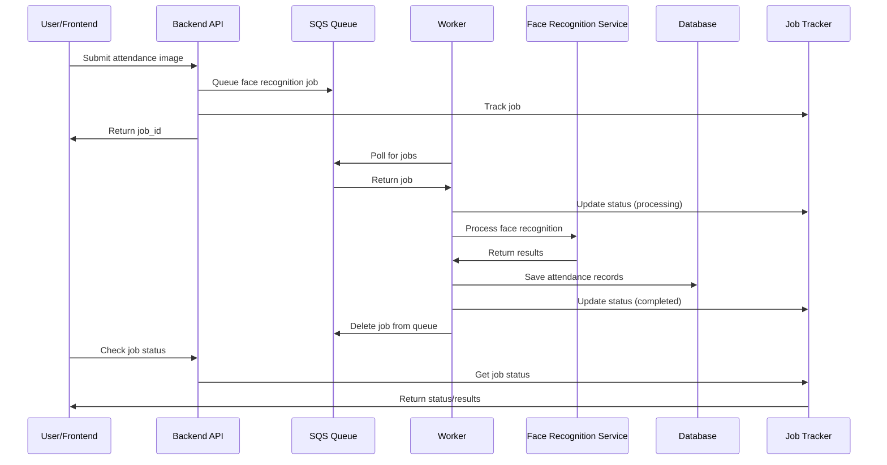

# Asynchronous Processing System

## Overview

The Acadion platform implements an asynchronous processing system for face recognition tasks using Amazon SQS (Simple Queue Service) to handle high-volume attendance processing efficiently. This system decouples the web API from the computationally intensive face recognition processing, providing better scalability and user experience.

## Architecture

### Components

1. **SQS Service** (`sqs_service.py`)
   - Manages SQS queues for job submission and processing
   - Handles job lifecycle (submit, receive, complete, fail)
   - Implements dead letter queue for failed jobs

2. **Job Tracker** (`job_tracker.py`)
   - Tracks job status and progress
   - Provides notifications for job completion
   - Maintains job history and statistics

3. **Face Recognition Worker** (`face_recognition_worker.py`)
   - Background workers that process face recognition jobs
   - Integrates with face recognition microservice
   - Handles job retry logic and error recovery

4. **Async Attendance Service** (`async_attendance_service.py`)
   - High-level service for submitting attendance processing jobs
   - Provides job status tracking and user management
   - Fallback to synchronous processing when needed

### Data Flow



## Configuration

### Environment Variables

```bash
# SQS Configuration
SQS_ENABLED=true
SQS_REGION=us-east-1
SQS_QUEUE_PREFIX=acadion
SQS_VISIBILITY_TIMEOUT=300
SQS_MESSAGE_RETENTION=1209600
SQS_MAX_RECEIVE_COUNT=3
SQS_LONG_POLLING=20

# Async Processing
ASYNC_PROCESSING_ENABLED=true
WORKER_COUNT=2
JOB_TIMEOUT=300
JOB_RETRY_ATTEMPTS=3
JOB_HISTORY_RETENTION_DAYS=7

# AWS Configuration
AWS_REGION=us-east-1
AWS_ACCESS_KEY_ID=your_access_key
AWS_SECRET_ACCESS_KEY=your_secret_key
```

### Queue Configuration

The system creates two SQS queues:

1. **Main Queue**: `acadion-face-recognition-{environment}`
   - Receives new face recognition jobs
   - Configured with dead letter queue redrive policy
   - Long polling enabled for efficient message retrieval

2. **Dead Letter Queue**: `acadion-face-recognition-dlq-{environment}`
   - Receives messages that failed processing after max retries
   - Used for debugging and manual intervention

## Deployment

### Using Docker Compose

```bash
# Start the async processing system
docker-compose -f docker-compose.async.yml up -d

# Scale workers
docker-compose -f docker-compose.async.yml up -d --scale face-worker-1=3
```

### Using Terraform

```bash
# Deploy SQS infrastructure
cd terraform/modules/sqs
terraform init
terraform plan -var="environment=dev"
terraform apply
```

### Using GitHub Actions

The system includes automated deployment via GitHub Actions:

```bash
# Trigger deployment
gh workflow run deploy-async-processing.yml \
  -f environment=dev \
  -f worker_count=2
```

## API Usage

### Submit Attendance Processing Job

```http
POST /api/async-attendance/submit
Content-Type: multipart/form-data

session_id: "session-123"
subject_id: "subject-456"
priority: 0
image: [image file]
```

Response:
```json
{
  "success": true,
  "job_id": "job-789",
  "session_id": "session-123",
  "subject_id": "subject-456",
  "status": "submitted",
  "estimated_processing_time": "30-60 seconds",
  "submitted_at": "2024-01-15T10:30:00Z"
}
```

### Check Job Status

```http
GET /api/async-attendance/job/{job_id}
```

Response:
```json
{
  "job_id": "job-789",
  "status": "processing",
  "progress_percentage": 50,
  "estimated_completion": "2024-01-15T10:31:00Z",
  "created_at": "2024-01-15T10:30:00Z",
  "last_updated": "2024-01-15T10:30:30Z",
  "metadata": {
    "session_id": "session-123",
    "subject_id": "subject-456"
  },
  "status_history": [
    {
      "status": "pending",
      "timestamp": "2024-01-15T10:30:00Z",
      "metadata": {}
    },
    {
      "status": "processing",
      "timestamp": "2024-01-15T10:30:30Z",
      "metadata": {
        "worker_id": "worker-1"
      }
    }
  ]
}
```

### Get User Jobs

```http
GET /api/async-attendance/jobs?limit=20
```

Response:
```json
{
  "jobs": [
    {
      "job_id": "job-789",
      "job_type": "face_recognition",
      "status": "completed",
      "progress_percentage": 100,
      "created_at": "2024-01-15T10:30:00Z",
      "last_updated": "2024-01-15T10:31:00Z",
      "session_id": "session-123",
      "subject_id": "subject-456"
    }
  ],
  "total": 1,
  "user_id": "user-123"
}
```

## Worker Management

### Running Workers Locally

```bash
# Start single worker
cd backend
python run_workers.py start --workers 1

# Start multiple workers
python run_workers.py start --workers 3 --log-level DEBUG

# Check worker health
python run_workers.py health

# Show statistics
python run_workers.py stats
```

### Worker Configuration

Workers can be configured via environment variables:

```bash
# Worker-specific configuration
WORKER_ID=worker-1
WORKER_COUNT=1
JOB_TIMEOUT=300
FACE_SERVICE_TIMEOUT=30
HEALTH_CHECK_INTERVAL=60
```

### Scaling Workers

Workers can be scaled horizontally:

1. **Docker Compose**: Use `--scale` flag
2. **ECS**: Update desired count in service
3. **Kubernetes**: Update replica count in deployment

## Monitoring and Observability

### CloudWatch Metrics

The system automatically creates CloudWatch alarms for:

- Queue depth monitoring
- Dead letter queue messages
- Worker health status
- Processing latency

### Logging

Structured logging is implemented across all components:

```python
logger.info("✅ Job completed successfully", extra={
    "job_id": job_id,
    "processing_time": processing_time,
    "worker_id": worker_id
})
```

### Health Checks

Health check endpoints are available:

```http
GET /api/async-attendance/health
```

```bash
# CLI health check
python run_workers.py health
```

## Error Handling and Recovery

### Retry Logic

Jobs are automatically retried on failure:

1. **Transient Errors**: Retry up to 3 times
2. **Permanent Errors**: Move to dead letter queue
3. **Timeout Errors**: Retry with exponential backoff

### Dead Letter Queue Processing

Failed jobs in the DLQ can be:

1. **Manually Reprocessed**: Move back to main queue
2. **Analyzed**: Debug processing issues
3. **Archived**: Store for historical analysis

### Graceful Shutdown

Workers support graceful shutdown:

```bash
# Send SIGTERM to worker process
kill -TERM <worker_pid>

# Workers will:
# 1. Stop accepting new jobs
# 2. Complete current jobs
# 3. Clean up resources
# 4. Exit gracefully
```

## Performance Optimization

### Queue Configuration

- **Long Polling**: Reduces API calls and improves efficiency
- **Batch Processing**: Process multiple messages per poll
- **Visibility Timeout**: Prevents duplicate processing

### Worker Optimization

- **Connection Pooling**: Reuse HTTP connections
- **Async Processing**: Non-blocking I/O operations
- **Resource Management**: Proper cleanup and memory management

### Scaling Strategies

1. **Horizontal Scaling**: Add more worker instances
2. **Vertical Scaling**: Increase worker resources
3. **Auto Scaling**: Scale based on queue depth metrics

## Security Considerations

### IAM Permissions

Workers require minimal IAM permissions:

```json
{
  "Version": "2012-10-17",
  "Statement": [
    {
      "Effect": "Allow",
      "Action": [
        "sqs:ReceiveMessage",
        "sqs:DeleteMessage",
        "sqs:GetQueueAttributes"
      ],
      "Resource": "arn:aws:sqs:*:*:acadion-face-recognition-*"
    }
  ]
}
```

### Data Security

- **Encryption**: SQS messages encrypted in transit and at rest
- **Access Control**: Queue access restricted to authorized services
- **Data Retention**: Automatic cleanup of processed jobs

## Troubleshooting

### Common Issues

1. **Jobs Stuck in Queue**
   - Check worker health and logs
   - Verify face recognition service availability
   - Check AWS credentials and permissions

2. **High Processing Latency**
   - Scale up worker count
   - Check face recognition service performance
   - Monitor queue depth and processing times

3. **Jobs Moving to DLQ**
   - Check worker error logs
   - Verify input data format
   - Test face recognition service manually

### Debugging Commands

```bash
# Check queue statistics
python run_workers.py stats

# View worker logs
docker-compose logs face-worker-1

# Check SQS queue in AWS Console
aws sqs get-queue-attributes --queue-url <queue-url> --attribute-names All

# Test face recognition service
curl http://face-recognition-service:8001/health
```

## Best Practices

1. **Job Design**
   - Keep jobs idempotent
   - Include sufficient metadata for debugging
   - Implement proper error handling

2. **Worker Management**
   - Monitor worker health regularly
   - Implement graceful shutdown procedures
   - Use appropriate scaling strategies

3. **Queue Management**
   - Monitor queue depth and age
   - Set appropriate visibility timeouts
   - Regularly process dead letter queues

4. **Testing**
   - Test with various image formats and sizes
   - Simulate failure scenarios
   - Load test with expected traffic volumes

## Future Enhancements

1. **Priority Queues**: Separate queues for different priority levels
2. **Batch Processing**: Process multiple images in single job
3. **Result Caching**: Cache face recognition results
4. **Advanced Monitoring**: Custom metrics and dashboards
5. **Auto Scaling**: Automatic worker scaling based on metrics