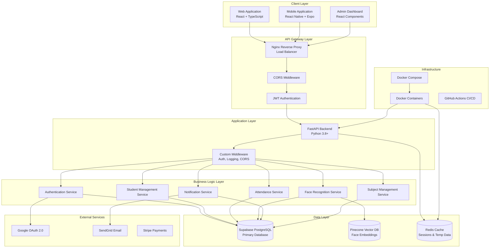

# High-Level System Design Architecture

## Overview

Acadion is a modern, AI-powered student management platform designed for educational institutions. The system follows a microservices architecture with clear separation of concerns, enabling scalability, maintainability, and cross-platform accessibility.

## System Architecture

## Core Components

### 1. Client Applications

#### Web Application (React + TypeScript)
- **Technology**: React 18, TypeScript, Tailwind CSS, Vite
- **Features**: Responsive design, real-time updates, progressive web app capabilities
- **Target Users**: Teachers, administrators, students (desktop/tablet access)
- **Key Pages**: Dashboard, attendance tracking, student management, analytics

#### Mobile Application (React Native + Expo)
- **Technology**: React Native, Expo 49, React Navigation
- **Features**: Camera integration, offline capabilities, push notifications
- **Target Users**: Students and teachers (mobile-first experience)
- **Key Features**: Face registration, attendance check-in, class schedules

#### Admin Dashboard
- **Technology**: React components with role-based access
- **Features**: System administration, user management, analytics, reporting
- **Target Users**: System administrators, institutional managers

### 2. API Gateway & Security

#### Nginx Reverse Proxy
- **Purpose**: Load balancing, SSL termination, static file serving
- **Features**: Rate limiting, request routing, caching headers
- **Configuration**: Production-ready with security headers

#### Authentication & Authorization
- **Method**: JWT-based authentication with refresh tokens
- **Providers**: Email/password, Google OAuth 2.0
- **Security**: bcrypt password hashing, role-based access control (RBAC)
- **Roles**: Student, Teacher, Administrator

### 3. Backend Services

#### FastAPI Application Server
- **Technology**: FastAPI 0.104+, Python 3.8+, Uvicorn ASGI server
- **Features**: Auto-generated OpenAPI docs, async/await support, type validation
- **Architecture**: Modular router-based structure with dependency injection

#### Core Business Services
- **Authentication Service**: User registration, login, OAuth integration
- **Student Management Service**: CRUD operations, enrollment tracking
- **Attendance Service**: Manual and AI-powered attendance tracking
- **Face Recognition Service**: OpenCV-based face detection and matching
- **Subject Management Service**: Class creation, enrollment, scheduling
- **Notification Service**: Real-time alerts, email notifications

### 4. Data Storage

#### Primary Database (Supabase PostgreSQL)
- **Purpose**: Main application data storage
- **Features**: Real-time subscriptions, row-level security, auto-generated APIs
- **Schema**: Users, students, subjects, attendance, enrollments, notifications
- **Scalability**: Horizontal scaling, connection pooling

#### Vector Database (Pinecone)
- **Purpose**: Face embedding storage and similarity search
- **Features**: High-performance vector operations, real-time indexing
- **Use Case**: Face recognition matching with configurable similarity thresholds
- **Security**: Encrypted vector storage, no raw image data retention

#### Cache Layer (Redis)
- **Purpose**: Session storage, temporary data, rate limiting
- **Features**: In-memory performance, pub/sub capabilities
- **Use Cases**: JWT token blacklisting, API rate limiting, temporary file storage

### 5. External Integrations

#### Google OAuth 2.0
- **Purpose**: Third-party authentication
- **Implementation**: Server-side OAuth flow with secure token exchange
- **Benefits**: Simplified user onboarding, enterprise SSO compatibility

#### SendGrid Email Service
- **Purpose**: Transactional email delivery
- **Use Cases**: Welcome emails, password resets, attendance notifications
- **Features**: Template management, delivery tracking, bounce handling

#### Stripe Payment Processing (Optional)
- **Purpose**: Subscription and payment management
- **Use Cases**: Institutional subscriptions, premium features
- **Security**: PCI-compliant payment processing

## System Characteristics

### Scalability
- **Horizontal Scaling**: Containerized services can be scaled independently
- **Database Scaling**: Supabase provides automatic scaling and connection pooling
- **Caching Strategy**: Redis reduces database load and improves response times
- **CDN Integration**: Static assets served through content delivery networks

### Security
- **Authentication**: Multi-factor authentication support, secure password policies
- **Authorization**: Role-based access control with granular permissions
- **Data Protection**: Encryption at rest and in transit, GDPR compliance
- **Privacy**: Face data stored as mathematical vectors, not images
- **API Security**: Rate limiting, input validation, SQL injection prevention

### Performance
- **Response Times**: Sub-100ms API responses for most operations
- **Face Recognition**: Group photo processing in under 3 seconds
- **Real-time Updates**: WebSocket connections for live data synchronization
- **Caching**: Multi-layer caching strategy (browser, CDN, Redis, database)

### Reliability
- **High Availability**: 99.9% uptime target with redundant services
- **Error Handling**: Comprehensive error logging and monitoring
- **Data Backup**: Automated database backups with point-in-time recovery
- **Monitoring**: Health checks, performance metrics, alerting systems

### Maintainability
- **Code Quality**: TypeScript for type safety, comprehensive testing
- **Documentation**: Auto-generated API docs, architectural decision records
- **CI/CD**: Automated testing, building, and deployment pipelines
- **Monitoring**: Centralized logging, performance monitoring, error tracking

## Deployment Architecture

### Development Environment
- **Local Development**: Docker Compose for consistent development environment
- **Hot Reload**: Vite for frontend, Uvicorn for backend development servers
- **Database**: Local Supabase instance or cloud development database

### Production Environment
- **Containerization**: Docker containers for all services
- **Orchestration**: Docker Compose or Kubernetes for production deployment
- **Load Balancing**: Nginx for request distribution and SSL termination
- **Monitoring**: Comprehensive logging and monitoring stack

### CI/CD Pipeline
- **Source Control**: Git with feature branch workflow
- **Testing**: Automated unit, integration, and end-to-end tests
- **Building**: Multi-stage Docker builds for optimized images
- **Deployment**: Blue-green deployment strategy with rollback capabilities

## Data Flow

### User Authentication Flow
1. User submits credentials through web/mobile client
2. API validates credentials against Supabase database
3. JWT token generated and returned to client
4. Subsequent requests include JWT in Authorization header
5. Middleware validates token and extracts user context

### Attendance Tracking Flow
1. Teacher uploads group photo through web interface
2. Face Recognition Service processes image using OpenCV
3. Face embeddings generated and compared against Pinecone database
4. Matched students identified and attendance records created
5. Real-time notifications sent to relevant users
6. Attendance data synchronized across all client applications

### Real-time Data Synchronization
1. Client applications establish WebSocket connections
2. Database changes trigger real-time events through Supabase
3. Events propagated to connected clients via WebSocket
4. Client applications update UI reactively without page refresh

## Technology Stack Summary

### Frontend Technologies
- **React 18**: Modern UI framework with concurrent features
- **TypeScript**: Type-safe JavaScript for better development experience
- **Tailwind CSS**: Utility-first CSS framework for rapid UI development
- **Vite**: Fast build tool and development server
- **React Query**: Server state management and caching

### Backend Technologies
- **FastAPI**: High-performance Python web framework
- **Pydantic**: Data validation and serialization
- **SQLAlchemy**: Database ORM with async support
- **OpenCV**: Computer vision library for face recognition
- **Redis**: In-memory data structure store

### Database Technologies
- **PostgreSQL**: Primary relational database via Supabase
- **Pinecone**: Vector database for face embeddings
- **Redis**: Cache and session store

### Infrastructure Technologies
- **Docker**: Containerization platform
- **Nginx**: Web server and reverse proxy
- **GitHub Actions**: CI/CD automation
- **Supabase**: Backend-as-a-Service platform

This high-level architecture provides a solid foundation for a scalable, secure, and maintainable student management platform that can grow with institutional needs while maintaining excellent performance and user experience.